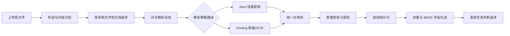

# 上传文档解析与索引设计

日期：2026-09-18  
状态：设计建议，尚未实施

## 1. 目标与当前问题

目标是让知识库接收常见业务文档，并让检索结果保留“这段内容来自哪份文件、哪一页或哪张表”的出处。优先覆盖运维手册、故障报告和表格，再扩展到扫描件。

当前 `/api/upload` 只按扩展名接收 `.txt`、`.md`。`VectorIndexService` 用 `Files.readString` 读取整个文件，`DocumentChunkService` 按 Markdown 标题、空行和字符数切块，然后逐块生成向量。上传在 HTTP 请求内同步完成。原文件按原始文件名覆盖，向量分片也按文件名替换；知识库没有独立的文档记录或解析状态。

因此，简单地给扩展名白名单增加 `pdf/docx/xlsx` 无法解决解析问题。现有读文件方式不能提取这些二进制格式，也没有表格、页码、工作表、幻灯片、OCR 和解析质量的表达空间。当前实现还需要在扩展格式前处理文件名边界、上传限制和“原文件已覆盖但索引失败”的一致性问题。

## 2. 主流解析路线

| 路线 | 常用实现 | 擅长 | 局限与适用位置 |
| --- | --- | --- | --- |
| 文本/元数据提取 | Apache Tika（内部使用 PDFBox、POI 等） | Java 集成简单，格式识别广，适合可复制文本的 PDF、Office、HTML、EPUB 等 | 统一纯文本会丢失部分版面和表格关系；图片文字需要额外 OCR。适合作为快速通道和类型检测。 |
| 元素与版面解析 | Docling、Unstructured | 输出标题、正文、列表、表格等元素及来源位置；可选 PDF 版面分析 | 模型和依赖更多，处理更慢。适合复杂 PDF、表格密集文件。 |
| OCR/文档图像解析 | Docling OCR、PaddleOCR PP-StructureV3 | 扫描 PDF、照片、截图中的文字、表格和版面 | 结果受图像质量影响，需记录 OCR 来源与低置信度警告。 |
| 托管文档分析 | Azure Document Intelligence 等 | 托管的 OCR、版面和表格分析 | 有调用费用、外传数据与供应商依赖；作为可替换的后续选项。 |

依据：Tika 官方区分“识别格式”与“确实能解析内容”，并明确图片解析器本身不提取图片文字；Docling 提供统一文档模型、PDF OCR/表格选项和结构化分片；Unstructured 提供 `fast`、`hi_res`、`ocr_only` 等策略；PDFBox 指出 PDF 的文字显示顺序并不等于可靠的阅读顺序。[Tika 格式与能力](https://tika.apache.org/docs/4.0.x/formats.html)、[Docling 文档模型](https://docling-project.github.io/docling/concepts/docling_document/)、[Docling 分片](https://docling-project.github.io/docling/concepts/chunking/)、[Unstructured 分区策略](https://unstructured.readthedocs.io/en/latest/core/partition.html)、[PDFBox FAQ](https://pdfbox.apache.org/3.0/faq.html)。

### 推荐组合

1. **Java 主应用保留上传、格式检测、状态管理、分片和索引。** 用 Tika 检测实际 MIME；简单格式可在 Java 内提取。
2. **复杂解析作为可选服务接入。** 优先评估自托管 Docling Serve：它有上传文件的 REST 接口及异步任务接口，Java 主应用不需要嵌入 Python 运行时。PDF 版面、表格和 OCR 统一走该适配器。PaddleOCR 可作为中文扫描件质量不足时的替换适配器。[Docling Serve API](https://docling-project.github.io/docling/usage/api_server/rest_api/)、[PaddleOCR PP-StructureV3](https://www.paddleocr.ai/v3.6.0/en/version3.x/pipeline_usage/PP-StructureV3.html)。
3. **先用项目样本文档做质量对比，再固定解析器。** 对每类文件比较可读性、表格完整性、页码定位、耗时和资源消耗；不以工具声称支持的格式数作为上线标准。

## 3. 产品支持范围

“工具能读”不等于“系统应开放上传”。建议按知识库需求设置白名单：

| 批次 | 格式 | 默认解析 | 输出定位 |
| --- | --- | --- | --- |
| 第一批 | `.txt`、`.md`、`.html`/`.htm`、`.csv`/`.tsv` | Java 文本/结构解析；HTML 只保留可见正文，CSV/TSV 保留列名 | 行号、标题路径、行范围 |
| 第一批 | `.pdf`（可复制文本） | 快速提取文本；文本层不足或排版复杂时标记待重新解析 | 页码、基础标题 |
| 第一批 | `.docx`、`.pptx`、`.xlsx` | Java/POI 结构解析；保留 Word 标题和表格、PPT 页、Excel 工作表与表头 | 章节、幻灯片号、工作表和行范围 |
| 第二批 | 复杂 PDF、扫描 PDF、`.png`、`.jpg`/`.jpeg`、`.tif`/`.tiff` | Docling 版面/OCR 解析 | 页码或图片号、区域坐标、OCR 标记 |
| 按需求增加 | `.doc`、`.xls`、`.ppt`、`.rtf`、`.odt`/`.ods`/`.odp`、`.epub`、`.eml`/`.msg` | 经样本验证后逐个开放；旧 Office 格式可能需要独立转换环境 | 随格式定义 |

Docling 官方列出 PDF、现代 Office、CSV、HTML、图片及更多格式；旧 Office 和 RTF 需要 LibreOffice。Tika 也覆盖大量格式，但两者均不意味着所有格式能以相同质量进入 RAG。[Docling 支持格式](https://docling-project.github.io/docling/usage/supported_formats/)、[Tika 支持格式](https://tika.apache.org/docs/4.0.x/formats.html)。压缩包、可执行文件、宏文档和任意 URL 抓取不进入首批范围。

## 4. 处理流程



### 4.1 校验与存储

- 用生成的 `documentId`/版本号保存文件，展示名称与实际存储路径分离。规范化文件名，检查真实 MIME、扩展名和允许格式的对应关系；不信任浏览器传来的 `Content-Type`。
- 限制单文件大小、页数、总展开量、解析耗时和并发数。拒绝加密/损坏文件并提供明确错误；不自动访问文档内的外部 URL。
- 计算 SHA-256。相同内容可跳过重复索引；同名不同内容成为新版本。新版本解析及向量化成功后再切换 `active_version`，失败时旧版本仍可检索。
- 解析输出一律视为不可信内容，前端预览做转义/净化。Tika 官方也明确其输出是内容提取，不是安全净化。[Tika 安全模型](https://tika.apache.org/security-model.html)。

### 4.2 解析模式

用户默认选择 `AUTO`，高级选项允许指定 `FAST`、`LAYOUT`、`OCR`：

| 模式 | 行为 | 用途 |
| --- | --- | --- |
| `AUTO` | 按实际格式路由；PDF 抽样检查文本层及页面结构，低文本页进入 OCR，复杂表格进入版面解析 | 普通上传默认值 |
| `FAST` | 直接提取可复制文本和基础结构，不运行 OCR | 大批量、格式简单、重速度 |
| `LAYOUT` | 识别阅读顺序、标题、表格、图片占位和页面位置 | 多栏或表格密集 PDF |
| `OCR` | 强制从页面图像识别文字和结构 | 扫描件、截图；处理慢 |

自动判定只能是启发式：例如按页文本量、不可识别字符比例及表格/图片信号触发升级。低质量结果标记 `NEEDS_REVIEW` 并保留“重新解析”操作，避免把空白或乱码当作成功索引。

### 4.3 统一中间模型

不要让分片服务直接消费一整串 Markdown。所有适配器输出同一 `ParsedDocument`：

```text
ParsedDocument(documentId, version, parser, parserVersion, warnings, blocks)
Block(type, text, headingPath, pageNo, slideNo, sheetName,
      rowStart, rowEnd, bbox, tableCells, extractionMethod, sourceOrder)
```

`type` 至少包括 `HEADING`、`PARAGRAPH`、`LIST`、`TABLE`、`CODE`、`IMAGE_CAPTION`。图片只有 OCR 结果或可靠说明时才进入文本索引；不能将“图像存在”当成图像内容。表格保留单元格结构，另生成带表头的检索文本。解析原始 JSON/中间模型可保存，以便调整分片规则时不重复 OCR。

### 4.4 分片与索引

- 根据标题层级、段落和列表切分；以嵌入模型的输入限额为上限，字符数仅作保护阈值。分片正文前附带文档名与标题路径，用于向量化和展示。
- 表格按行组切块，重复列名；不把单元格孤立切开。Excel 按工作表分组，PPT 按幻灯片分组，PDF 保留页码。大表可拆成多块，每块都带表头。
- 每块保存 `documentId`、版本、块类型、页/幻灯片/工作表与行范围、解析方法及警告。检索结果能回指原文件和位置；原有 pgvector + BM25/RRF 检索先沿用。
- 当前 BM25 查询每次加载所有分片并重建索引。文档量增长后需改为持久化/增量词法索引或数据库全文检索；这是扩容阶段任务。

Docling 的结构分片和 token 分片也采用“保留标题/表格上下文，再按 token 细化”的方法，可作为质量对照。[Docling 分片](https://docling-project.github.io/docling/concepts/chunking/)。

## 5. 数据与接口变化

建议新增 `knowledge_documents`（ID、展示名、MIME、SHA-256、原文件路径、活动版本、状态、创建/更新时间）及 `knowledge_document_versions`（版本、解析模式、解析器及版本、警告、页数、失败原因）。`document_chunks` 增加 `document_id`、`document_version` 和来源位置字段，逐步弃用按 `file_name` 作为唯一归属。旧 `.txt/.md` 记录通过迁移脚本补齐文档 ID，不直接删除。

上传接口保留 `/api/upload`，增加可选 `parseMode=AUTO|FAST|LAYOUT|OCR`。复杂文档以 `202 Accepted` 返回 `documentId`、`version` 和 `status=QUEUED`；增加状态/预览/重解析接口。前端展示 `QUEUED → PARSING → INDEXING → READY`，失败时显示原因和重试入口。旧同步响应可在过渡期用于小型 txt/md 文件，前端最终统一按任务状态处理。

删除时按 `documentId` 删除所有版本、分片和原文件。避免只按文件名删除造成不同用户或同名版本误删；如果将来支持多用户，还应在文档表加入所有者/知识库权限。

## 6. 落地顺序与验收

1. **基础改造**：文档 ID、版本、异步状态、上传校验、原子发布和失败保留旧版本；保持现有 txt/md 查询行为。
2. **常见格式**：先实现 HTML、CSV/TSV、可复制文本 PDF、DOCX、PPTX、XLSX；对每种格式提供来源位置和预览。
3. **复杂文档**：接入 Docling Serve，开放 `LAYOUT` 与 `OCR`；用中文扫描件和表格样本决定是否再接 PaddleOCR。Docling 提供同步及异步 REST 转换接口，适合独立进程部署。[Docling Serve API](https://docling-project.github.io/docling/usage/api_server/rest_api/)。
4. **评估后扩展**：按真实使用量增加旧 Office、ODF、EPUB、邮件等，并优化词法索引。

验收样本至少覆盖：正常/损坏/加密文件、同名更新、纯文本 PDF、扫描 PDF、双栏 PDF、跨页表格、Word 标题与表格、Excel 多工作表、PPT 多页、中文图片、空文件及超限文件。关键判断是：解析失败不覆盖旧索引；空内容不会显示成功；每个可检索片段能定位到源文件；表格问答保留列名和行关系；OCR 片段明确标记来源；用户能看见解析状态与警告。
