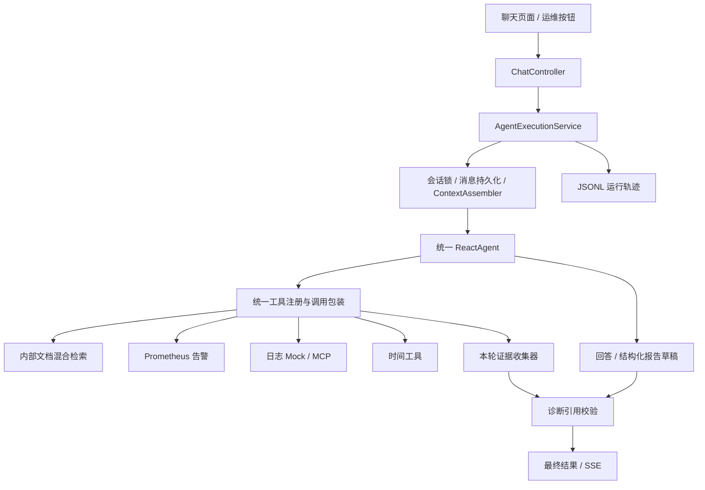

# 单 Agent 改造计划

日期：2026-09-16  
状态：实施中。统一单业务 Agent 架构已落地；验收缺口（启动装配、流式终态、超时取消、证据与报告契约、预算与回归测试）按 2026-09-16 验收报告修复。  
依据：当前工作区代码，包含未提交的会话管理、诊断及轨迹相关实现。

## 1. 改造目标与决策

把问答 Agent 和运维多 Agent 流程统一为一个业务 Agent。该 Agent 同时具备知识库检索、告警查询、日志查询和时间查询能力，根据任务要求完成问答或运维诊断。

采用以下设计：

- 只有一个业务 Agent 定义和一套执行流程，不再创建 Supervisor、Planner、Executor。
- 保留 `CHAT`、`OPS` 两种任务模式，用于配置任务要求、输出格式和执行预算，不通过模式创建不同角色的 Agent。
- 保留普通聊天、流式聊天和运维按钮；运维按钮成为统一 Agent 的快捷任务入口。
- 问答与运维可以使用同一个会话，支持“先描述故障 → 点击分析 → 继续追问”。
- 规划、工具调用和根据结果调整下一步，由单个 ReactAgent 的循环完成。
- 同一轮中的工具结果直接进入该 Agent 的消息上下文，取消跨 Agent 的反馈摘要交接。

“一个 Agent”指复用一个实现和能力定义，不是把可变运行状态放进全局单例。每个请求仍然独立创建运行上下文及 Agent 实例，按会话 ID 读取历史。

现有滚动摘要服务可以继续调用模型压缩历史。它是辅助能力，不承担任务规划、路由或执行，不属于第二个业务 Agent。

## 2. 当前实现与需要替换的部分

| 范围 | 当前代码行为 | 改造方向 |
|---|---|---|
| 问答 | `ChatController` 创建 ReactAgent，支持同步与 SSE | 抽取成统一执行入口 |
| 运维 | `AiOpsService` 创建 Supervisor、Planner、Executor | 替换为单 Agent 的 OPS 任务 |
| 工具 | 问答和运维已经注册了基本相同的本地与 MCP 工具 | 统一注册、过滤、包装和命名检查 |
| 会话 | 问答接入 PostgreSQL 历史与滚动摘要 | 运维也走相同生命周期 |
| 运维上下文 | 每次新建编排，未读取问答会话 | 按请求会话 ID 组装上下文 |
| 运维输出 | 等待编排完成，再将报告按 50 字符切片发送 | 展示真实进度，校验完成后交付最终报告 |
| 诊断校验 | 从 Executor 反馈构造证据，整份报告视作一个结论 | 从实际工具结果取证，逐条校验结论引用 |
| 运行轨迹 | 问答接入 JSONL，运维尚未接入 | 两种模式统一接入 |
| 评测 | 40 个预设证据场景，不运行真实 Agent | 保留规则测试，补充执行链路测试 |

主要依据文件：

- `src/main/java/org/example/controller/ChatController.java`
- `src/main/java/org/example/service/ChatService.java`
- `src/main/java/org/example/service/AiOpsService.java`
- `src/main/java/org/example/context/ContextAssembler.java`
- `src/main/java/org/example/diagnosis/DiagnosisService.java`
- `src/main/resources/static/app.js`

当前依赖为 Spring AI Alibaba `1.1.0.0-RC2`。本地依赖实现中，子 Agent 默认继承父流程消息、默认仅回传最后回答；项目未覆盖这两个选项。改造后不再依赖子 Agent 的消息继承与回传行为。

当前运维系统提示词中的 `{input}`、`{planner_plan}`、`{executor_feedback}` 不应继续保留：该版本的状态模板渲染作用于指令消息，不能假定 `.systemPrompt(...)` 会替换这些字段。新实现直接组装标准消息，不依赖这类隐式占位符。

## 3. 目标架构



说明：诊断校验是普通 Java 规则逻辑，不是独立 Agent；实际代码应先获得报告草稿，再完成校验和渲染。CHAT 模式的普通回答不强制经过运维报告校验。

### 3.1 建议职责划分

以下名称为建议命名，可在实施时按现有代码风格微调。

| 组件 | 职责 |
|---|---|
| `ChatController` | 参数校验、兼容旧接口、同步或 SSE 响应适配 |
| `AgentExecutionService` | 执行一轮任务：加锁、建轮次、组装上下文、调用 Agent、校验、提交、清理 |
| `UnifiedAgentFactory` | 构建唯一业务 Agent，装配模型、提示词、工具和 Hook |
| `AgentTaskPolicy` | 按 CHAT / OPS 提供任务要求、预算和输出约定 |
| `AgentToolRegistry` | 整理本地及 MCP 工具，处理模式切换、同名冲突和调用包装 |
| `AgentRunContext` | 保存本轮 ID、计数器、截止时间、证据和取消状态；不跨请求共享 |
| `ConversationService` / `ContextAssembler` | 继续负责后端会话记忆和历史压缩 |
| `DiagnosisService` / `DiagnosisValidator` | 校验结构化结论与实际证据的引用关系 |
| `TrajectoryService` | 记录统一执行流程，区分任务模式与传输方式 |

不把控制器、模型构建、会话操作、证据处理全部塞进一个大型 Service。统一的是 Agent 执行语义，不要求所有代码合并成一个类。

## 4. 请求接口与兼容策略

### 4.1 问答接口增加可选模式

保留 `POST /api/chat` 和 `POST /api/chat_stream`。在现有请求中增加可选的 `Mode`，缺省为 `CHAT`：

```json
{
  "Id": "session-123",
  "Question": "检查 payment-service 当前告警，结合日志判断可能原因",
  "Mode": "OPS"
}
```

- 继续兼容现有 `Id` / `Question` 及大小写别名。
- `Mode` 支持大小写归一化；未知值明确返回参数错误。
- 这两个接口仍要求非空问题。
- 两种模式调用同一个执行服务和 Agent 工厂。
- CHAT 可以按需调用运维工具；OPS 的区别是要求完整诊断任务和报告，不是额外增加一套工具。

### 4.2 保留运维快捷接口

`POST /api/ai_ops` 保留为 SSE 兼容适配器，不再自行创建模型或 Agent。

允许可选请求体：

```json
{
  "Id": "session-123",
  "Question": "重点检查 payment-service 最近一小时的异常"
}
```

- 指定 ID：使用对应会话历史，并将本次诊断纳入该会话。
- 未指定 ID：创建新会话。
- 无请求体或问题为空：使用默认任务“分析当前活动告警，查询必要的文档与日志，输出诊断报告”。
- 接口固定映射为 `OPS`，不受请求中的其他模式值影响。
- 前端运维按钮传递当前 `sessionId`；需要独立排查时，用户先新建会话。
- 当前未使用的 `AIOpsRequest.userRequest` 不视为已公开契约；实施前检查引用，再将 DTO 替换或调整为实际请求结构。

### 4.3 响应与 SSE

保留现有同步响应基本结构以及 SSE 的 `content`、`done`、`error` 消息。新增可选事件：

- `meta`：返回 `sessionId`、`requestId`、`runId`、任务模式。
- `progress`：例如“正在查询告警”“日志查询失败，尝试缩小范围”，来自实际执行事件。

前后端同时更新事件解析，未知事件应忽略；按 SSE 空行边界解析完整事件，不使用正则提取 JSON。未提供会话 ID 的 SSE 调用方可通过 `meta` 获得后续追问所需的 ID。

同步接口和流式接口共享最终结果对象，不分别拼接业务答案。

## 5. 上下文、生命周期与流式语义

### 5.1 一轮任务的公共流程

1. 校验请求，解析会话 ID、任务模式和本轮问题。
2. 获取会话执行锁；锁等待纳入请求截止时间，防止排队请求无限等待。
3. 写入 `PENDING` 用户消息，创建本轮轨迹和运行上下文。
4. 使用现有摘要与最近消息机制组装模型输入。
5. 添加本轮可信任务策略，创建统一 Agent；执行工具调用循环。
6. 获取权威最终结果；OPS 还需要解析、校验及渲染诊断报告。
7. 在事务中提交用户消息及最终 assistant 回答，完成轨迹记录。
8. 返回结果或发送 `done`，释放运行资源和会话锁。

异常、超时或用户取消必须进入统一终止处理。成功前发生终止时，待完成轮次标为 `FAILED`，不进入未来上下文；已经提交成功的轮次不能因为网络发送失败被改判失败。

使用一次性终止状态，防止模型结束、SSE 断开和超时回调重复提交或重复释放锁。

### 5.2 会话记忆与本轮工作记忆

- 会话记忆：继续保存用户请求与最终回答，并使用滚动摘要控制历史长度。
- 本轮工作记忆：保留该轮 Agent 实际需要的工具调用与结果。
- 运行轨迹：保存可回溯事件，不自动作为下一轮模型输入。
- 工具调用与结果必须成对保留或处理，不能留下没有对应调用的工具消息。
- 旧报告的时间、服务范围和证据引用必须可辨认；涉及“当前状态”的追问重新取证，不能把旧告警当成实时数据。
- 摘要内容和工具结果继续作为参考数据，不得覆盖系统任务规则。

数据库表结构优先复用。若需要保存模式和运行关联，使用已有消息 `metadata` 字段，并补齐对应读写；无需为每个模式单独创建消息表。

### 5.3 不把中间文本误存成最终回答

当前流式问答累计所有模型文本增量的方式需要调整。工具调用前的说明与最终回答可能来自不同模型轮次，不能无区别拼成一个最终答案。

- CHAT：保留实时生成体验，前端区分过程与最终回答；数据库保存完成后确定的最终 assistant 消息。
- OPS：工具执行期间实时发送 `progress`；最终生成结构化草稿，经规则校验后由服务端渲染并交付 Markdown 报告。
- OPS 第一版不承诺报告正文逐 token 输出，避免用户先看到未校验结论；不再通过固定字符切片模拟实时推理。
- 从框架终态提取结果的具体 API，先针对当前依赖版本做小型验证，覆盖多轮工具调用和无工具调用两种路径。

### 5.4 取消与超时

SSE 超时、客户端断开和显式取消需要停止订阅及后续调度。对已经发出的外部调用设置超时；无法中断的调用，其迟到结果应被终止状态丢弃，不能再次提交消息。

请求级状态必须显式传递给 Hook 或工具包装器，不依赖可能跨 Reactor 线程失效的普通 `ThreadLocal`。

## 6. 模型、工具与执行边界

### 6.1 一个可配置的模型入口

新增统一 Agent 配置，明确指定实际业务模型；移除主流程对 `DashScopeChatModel.DEFAULT_MODEL_NAME` 的隐式依赖。模型名使用部署环境验证过的值，不在本计划中指定新型号。

CHAT、OPS 可以配置不同的输出预算和超时，但使用同一 Agent 定义。超时、重试配置必须显式传入实际创建的客户端，不能仅凭配置文件中存在字段就认为已经生效。

现有 `rag.model` 只控制未接入当前接口的 `RagService`，不能将它继续当作主 Agent 的模型设置。确认无调用方后再清理遗留服务与配置。

### 6.2 统一工具注册

保留文档混合检索实现，不在此次改造中重写分片、Embedding、BM25 或 RRF。

优先处理以下工具问题：

- `QueryLogsTools` 当前无条件注册。改为明确的条件装配：只有 `cls.mock-enabled=true` 才注册本地 Mock 日志工具。
- 真实日志模式只暴露已连接的 MCP 日志工具；通过明确配置区分 Mock 和真实连接，避免同时加载相互冲突的同名工具。
- MCP 不可用时，普通问答仍可使用可用工具；需要日志的诊断明确说明能力缺失，不将占位地址或失败结果当作有效数据。
- 对可选 MCP Provider 做空集合处理，并验证对应自动配置是否仍会阻断启动；启动行为以实际测试为准。
- 告警查询失败时向模型和报告提供失败状态；不要只在日志中记录异常。
- 工具名冲突在注册阶段明确处理，不静默覆盖。

收集证据需要覆盖本地与 MCP 工具。可将本地方法工具转换为 ToolCallback 后统一包装，或使用当前版本支持的工具拦截机制；实施时选择一种入口，避免重复执行与重复采集。

### 6.3 将运行限制落实到代码

首版应提供可配置的最大模型调用次数、工具调用次数、总耗时、工具结果长度及重复失败限制。默认值在小规模验证后确定，不将本计划中的设计预算当作已测得的最优参数。

- 按工具调用 ID 计数；一次模型回复发出多个调用也要逐个计数。
- 对同一工具及相同标准化参数的连续失败或空结果设置上限；达到上限后拒绝重复调用，返回明确原因。
- 工具结果过长时，对模型输入提供受控截断或摘要，保留来源和截断标记；证据记录与展示记录分开处理。
- 预留报告生成预算。诊断预算耗尽时停止继续取证，输出部分结果与缺失证据；没有生成预算时使用确定性的未完成说明。
- 历史预算与本轮工具消息预算共同计算，保留系统提示、工具定义和输出空间。当前 `ContextAssembler` 只处理入场历史，不能当作整个运行过程的预算控制器。

所有运行计数和证据容器均归属当前请求，不放在共享 Service 的可变字段中。

## 7. 诊断证据与报告

### 7.1 证据来自实际工具返回

取消以 Executor 自述作为事实来源的 `fromExecutorFeedback(...)` 主链路。

工具包装器在调用成功后为结果分配本轮证据 ID，并保存：

- `runId`、`toolCallId`、工具名和查询时间；
- 查询参数、查询时间范围和数据来源；
- 可提取的服务名、告警名、资源及时间戳；
- 实际返回内容及处理状态。

同一个证据 ID 随工具结果交给模型，最终报告才能引用它。已有 `Evidence` 模型缺少的字段可用新的运行证据记录或扩展字段承载。失败、空结果和解析失败不伪装成成功日志证据；未知服务保留为未知。

### 7.2 OPS 输出结构化草稿

同一个 Agent 在最终回答阶段输出约定结构：告警概况、逐条结论、引用证据 ID、未解决问题和处理建议。服务端解析后使用模板生成 Markdown，不再依赖模型同时生成一份正文和一份可能不一致的结构化结论。

结构化格式错误时，允许在本轮预算内进行一次修正；仍然失败则明确报告生成失败，不追加“校验通过”。这个修正不创建新的评审 Agent。

### 7.3 校验范围与失败处理

复用并调整 `DiagnosisValidator`，至少检查：

1. 引用 ID 存在于本次实际工具结果中。
2. 引用的是有效数据，而非工具错误或空结果。
3. 结论的服务、告警或资源与证据一致；未知归属不能直接视为匹配成功。
4. 明确区分观察事实、待验证原因和处理建议。

证据引用正确不等于根因已证明。对外文案使用“证据引用有效”“待验证假设”等表述，不把现有 `SUPPORTED` 直接展示为“根因已确认”。

证据不足时保留假设并说明下一步需要什么。首版不额外实现一个自动补查编排器；若以后加入补查，也由同一个 Agent 在既有预算内处理。

## 8. 代码改动清单

| 文件或目录 | 计划改动 |
|---|---|
| `controller/ChatController.java` | 三个入口委托统一服务，清理重复模型与运行生命周期代码 |
| `service/ChatService.java` | 将模型、工具和 Agent 构建迁移至统一工厂，最终消除重复入口 |
| `service/AiOpsService.java` | 移除 Supervisor / Planner / Executor 构建和旧输出状态提取 |
| `service/AgentExecutionService.java` 等新增组件 | 实现唯一执行流程、任务策略、请求级状态与结果模型 |
| `agent/tool/QueryLogsTools.java` | 修正 Mock 条件装配 |
| 工具注册与包装组件 | 本地 / MCP 统一接入，采集证据与调用计数 |
| `context/`、`conversation/` | 复用历史机制，补齐模式元数据、超时及终止一致性 |
| `diagnosis/` | 实际工具证据解析、结构化草稿、逐条校验和报告渲染 |
| `trajectory/` | 覆盖 CHAT / OPS，记录任务模式、传输模式和终止原因 |
| `dto/AIOpsRequest.java` | 与可选请求体契约统一，清理未使用字段 |
| `resources/application.yml` | 统一 Agent 模型、预算及 Mock / MCP 配置 |
| `resources/static/app.js` | 运维传会话 ID，共享 SSE 解析，区分过程和最终结果 |
| `eval/`、`src/test/` | 保留规则测试，增加真实执行路径的可重复验证 |
| `README.md`、`docs/context-management-design.md` | 更新实际架构、会话行为和运行方式 |

上述路径相对于 `src/main/java/org/example/`，资源、测试和文档路径按表中标注解析。最终以实际职责命名为准，不为满足文件清单机械拆类。

## 9. 分阶段实施与验收

### 阶段一：建立单 Agent 主链路

实施：抽取统一执行服务与工厂；保留三条接口；将 `/ai_ops` 映射为 OPS 任务，去除多 Agent 编排；显式配置业务模型并修正工具装配。

验收：

- 业务运行路径不再创建 Supervisor、Planner、Executor。
- CHAT 和 OPS 均可完成一次“模型 → 工具 → 模型回答”的执行。
- 原有同步和流式问答请求仍可使用；无请求体的 `/ai_ops` 仍接受请求。
- 临时尚未接入新证据校验时明确显示“未校验”，不能继续使用旧逻辑宣称校验成功。

### 阶段二：统一会话、流式输出与运行控制

实施：运维按钮携带会话 ID；复用历史与摘要；统一 SSE；实现取消、超时、执行上限和权威最终结果提取；两种模式均接入轨迹。

验收：

- 同一会话中先说明服务与时间范围，再点击运维分析，模型输入包含相关背景。
- 完成后追问能够读取诊断结果；新会话不包含其他会话内容。
- 中间工具说明不会被错误拼入最终持久化答案。
- 工具失败、SSE 断开与超时均能终止后续执行，释放锁且不会重复提交。
- 日志中可通过同一 `runId` 定位工具调用、结果和终止原因。

### 阶段三：接入实际证据与报告校验

实施：包装工具收集证据；定义并解析结构化报告；复用诊断规则；服务端生成最终 Markdown。

验收：

- 报告的每个证据 ID 可追溯至本轮真实工具返回。
- 无证据、跨服务、失败结果、非法引用、格式错误均有明确处理。
- 证据不足时输出假设和缺失信息；不能因存在任意文本就认定结论被支持。
- OPS 执行过程提供真实进度，最终正文在校验完成后交付。

### 阶段四：回归验证与收尾

实施：更新前端、文档与配置说明；清理无调用方的多 Agent 提示词、旧提取逻辑及遗留服务；完成自动化和小规模集成验证。

验收：

- 当前检索、上下文、轨迹及诊断相关单元测试通过。
- 新增测试覆盖统一执行流程的关键成功与失败分支。
- 在可用的数据库、DashScope、Prometheus / MCP 环境下记录一次完整验证结果；缺少依赖时明确列出未验证项。
- 仓库文档不再声称运行 Supervisor 多 Agent，接口说明与代码一致。

四个阶段全部完成才视为本次改造完成。前两阶段是迁移中间状态，不能替代证据与报告链路的最终验收。

## 10. 测试与评估方案

### 10.1 可重复的自动化验证

使用脚本化模型响应和固定工具返回驱动真正的统一执行代码，而不只是手动构造 `AgentTrace`：

- 无需工具的普通问答。
- 工具调用后正常回答，以及连续多个工具调用。
- 同一会话从 CHAT 切到 OPS 再继续追问。
- 空告警、工具错误、重复失败、预算耗尽。
- 两个不同会话并发，证据与计数互不串扰。
- 流完成、断线与超时竞态，确保终态、持久化和锁一致。
- 结构化报告错误、引用不存在、跨服务或未知归属。

原有 40 场景继续用于诊断规则回归，其通过率与延迟不得标注为真实 Agent 的成功率与耗时。默认 Noop LLM Judge 也不得计为实际模型评审。

### 10.2 外部服务集成验证

在固定文档、相同告警和日志数据、相同模型及提示问题下记录：

- 任务是否完成、最终结论是否有可核查引用；
- 模型与工具调用次数、总 token、总耗时和首次进度时间；
- 无依据结论、跨服务引用与未说明失败的数量；
- 用户追问能否保持正确的服务和时间范围。

如保留改造前基线，可比较单 Agent 与原实现；样本量、外部依赖和模型参数应一并记录。不预先承诺成功率提升或特定性能比例。

## 11. 范围与迁移注意事项

本次聚焦 Agent 统一，不同时推进以下工作：大规模检索优化、分布式会话锁、自动修复执行器、新的用户权限系统或独立评审 Agent。

主要风险与处理：

- 单 Agent 本轮工具消息更集中：通过结果长度限制和总上下文预算控制，保留证据来源。
- 共用会话可能引入旧故障信息：保留时间范围，涉及实时判断重新查证。
- 框架 API 与事件行为存在版本差异：以锁定依赖的小型验证为准，再接入正式流程。
- 外部配置尚有占位值：分别验收 Mock 与真实模式，不用 Mock 成功证明生产接入可用。

实施应基于当前工作区建立可追溯的改动边界，不覆盖已有未提交工作。按阶段组织小范围变更；需要回退时仅撤销本次改造对应变更，不回滚用户的其他修改。初版优先复用现有数据库结构，避免同时引入破坏性迁移。

## 12. 最终完成标准

- 运行时只有一个业务 Agent 定义，没有 Supervisor 路由和 Planner / Executor 交接。
- 问答与运维走同一生命周期，并支持同一会话内切换与追问。
- Agent 自行完成查询与调整步骤，代码负责预算、终止、证据和结果一致性。
- 最终报告引用本轮实际工具证据；不足之处明确展示，不冒充已证实根因。
- 现有接口兼容性、工具 Mock / 真实切换、SSE、持久化与轨迹均经过对应验证。
- 交付记录明确写出改动内容、测试结果以及尚未验证的外部依赖。
